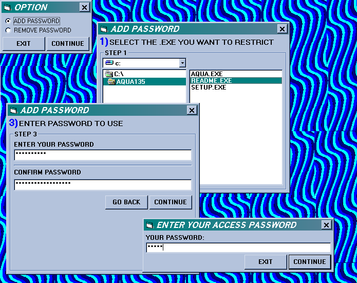



## ACCESS DENIED

### Description

WELL I HOPE THIS SUBMISSION GOES OVER BETTER THAN MY LAST. THIS PROGRAM ALLOWS TO PUT A PASSWORD TO JUST ABOUT ANY PROGRAM. YOU CAN JUST LOOK AT THE CODE BUT FOR THE PROGRAM TO ACTUALLY WORK YOU NEED TO COMPILE BOTH PROJECTS INTO .EXE'S BE SURE TO NAME THE PASSWORD.VBP .EXE "PASS.EXE". THIS CODE AND PROGRAM SHOULD BE EASY TO USE AND UNDERSTAND. I STILL AM NOT SURE ABOUT CORRECT SPACING BUT ALL THE CODE IS COMMENTED WITH DETAIL. HOPEFULLY THIS PROGRAM IS MORE UNDERSTANDABLE. PLEASE VOTE, AND GIVE FEEDBACK, EVEN IF YOUR VOT IS POOR. ENJOY!
 
### More Info
 

             |
---                |---
**Submitted On**   |2002-07-07 20:34:44
**By**             |[JOSHUA STEWARD](https://github.com/Planet-Source-Code/PSCIndex/blob/master/ByAuthor/joshua-steward.md)
**Level**          |Advanced
**User Rating**    |3.1 (28 globes from 9 users)
**Compatibility**  |VB 6\.0
**Category**       |[Files/ File Controls/ Input/ Output](https://github.com/Planet-Source-Code/PSCIndex/blob/master/ByCategory/files-file-controls-input-output__1-3.md)
**World**          |[Visual Basic](https://github.com/Planet-Source-Code/PSCIndex/blob/master/ByWorld/visual-basic.md)
**Archive File**   |[ACCESS\_DEN103252772002\.zip](https://github.com/Planet-Source-Code/joshua-steward-access-denied__1-36697/archive/master.zip)

